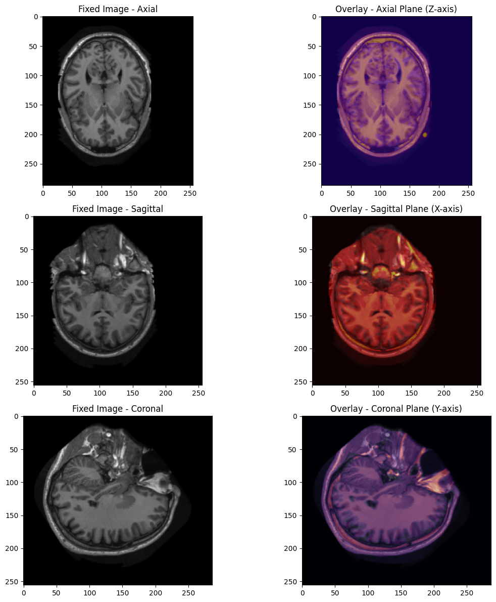

# Atlas-Based Brain Tissue Segmentation
This project is the part of Medical Imaging and Applications program.

### Project Overview
This project involves the use of atlas-based segmentation and Expectation-Maximization (EM) for segmenting brain tissues into key categories such as cerebrospinal fluid (CSF), gray matter (GM), and white matter (WM). The workflow leverages Elastix for image registration, probabilistic atlas construction, and EM optimization to achieve accurate tissue segmentation.

### Workflow Summary
**1. Registration with Elastix**
 
Align test images to a reference atlas (probabilistic atlas or manually selected template).
 
    Steps:
    The Elastix library is used to register images from the test dataset to a fixed image or a probabilistic atlas.
     
    Registration produces transformation parameters, which are then applied to the moving image (test image) and corresponding labels or masks.
     
    The transformation ensures spatial alignment of test images with the atlas, creating a consistent spatial representation.

    

**2. Probabilistic Atlas Construction**
 
Create a probabilistic atlas from training images and their corresponding labels to guide segmentation.
 
Steps:
Compute a voxel-wise probability distribution for each tissue type (CSF, GM, WM) based on labeled training data.
 
For each voxel in the atlas, calculate the probability of belonging to a specific tissue type based on label frequencies.
 
Normalize histograms across the dataset to ensure probabilities sum to 1.

**3. EM Algorithm for Segmentation**
 
Use the probabilistic atlas and tissue models to segment test images into tissue classes.
 
**Initializations for EM:**
 
Segment using the intensity values alone.
 
Tissue Model Initialization: Use precomputed intensity distributions from the atlas.
 
Label Propagation Initialization: Use position information from the atlas.

